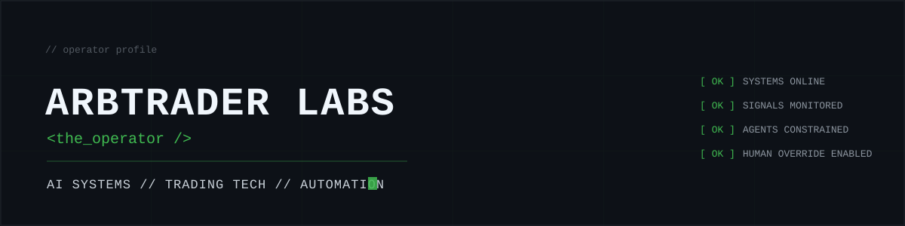
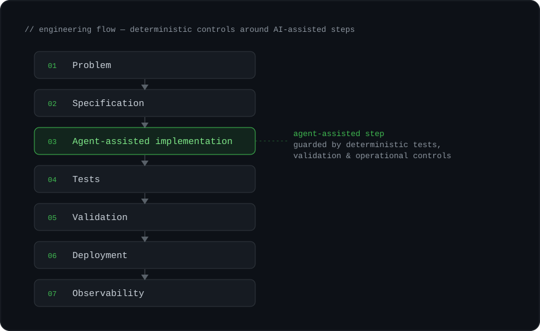

<!-- there is no spoon -->



> Building systems at the intersection of production operations,
> electronic trading, automation and applied AI.

```text
$ env | grep -E 'OPERATOR|HOST|UPTIME|DESK|STATUS'

OPERATOR=arbtrader
HOST=markets
UPTIME=20+ years
DESK=trading-technology
STATUS=production

$ history | tail -6

market-data pipelines
FIX order-flow tracing
n8n workflow automation
Forex algorithm testing
historical market research
LLM-assisted automation

$ wake_up neo
[ OK ] operator online
```

---

## [ ACTIVE_SYSTEMS ]

```text
[ CRASHDASH ]
TYPE   market-data research platform
STATE  PUBLIC
FLOW   data -> validate -> signal -> publish
```

Automated market-data research and analytics platform for studying significant price dislocations across UK-listed equities.

- historical & daily market-data pipelines
- data-quality validation
- deterministic research signals
- regression & parity testing
- Linux-hosted automation · static publication (GitHub Pages)

**Repo:** [github.com/arbtraderlabs/CrashDash](https://github.com/arbtraderlabs/CrashDash)

```text
[ CRYPTOSQUAWK ]
TYPE   event-driven AI market intelligence
STATE  PRIVATE CORE / SHOWCASE LIVE
FLOW   ingest -> enrich -> gate -> narrate
```

Condenses high-volume market events into a smaller set of useful real-time narratives. The public showcase is a synthetic demonstration of the concept, workflow and controls.

- event ingestion & normalisation
- AI/LLM enrichment with structured outputs
- deterministic safety gates
- evaluation & shadow validation
- replay & simulation
- production observability
- AI cost / latency controls

SHOWCASE  https://arbtraderlabs.github.io/cryptosquawk-showcase/
REPO      https://github.com/arbtraderlabs/cryptosquawk-showcase

Production core remains private. Public showcase uses synthetic data.

```text
[ OFFCYCLE ]
TYPE   VS Code developer tooling
STATE  PUBLIC
STACK  TypeScript -> VS Code API
```

Lightweight developer-tooling experiment built around the VS Code extension ecosystem.

- TypeScript · VS Code Extension APIs
- Git workflows
- AI-assisted development
- product experimentation

**Repo:** [github.com/arbtraderlabs/offcycle](https://github.com/arbtraderlabs/offcycle)

## [ SIGNAL_PATH ]

How systems here get built: AI is one tool inside an engineering process. Every AI-assisted step is surrounded by deterministic tests, validation and operational controls.

```text
problem -> specification -> build -> test -> evaluate -> deploy -> observe -> iterate
```



```text
// deterministic where it matters
// AI-assisted where it helps
```

## [ OPERATOR_TOOLKIT ]

`linux` `bash` `sql` `fix` `git` `docker` `typescript`

`llm-apis` `ollama` `agentic-workflows` `structured-output`

`incident-response` `monitoring` `automation` `market-data`

> tools change. systems thinking doesn't.

---

## [ CURRENT_EXPERIMENTS ]

- making AI systems observable, testable and cheaper to run
- using agents inside controlled production workflows
- turning operational problems into small useful tools
- replaying and validating real-world event pipelines
- exploring where local models actually make sense

---

> systems first. signals second. hype last.
